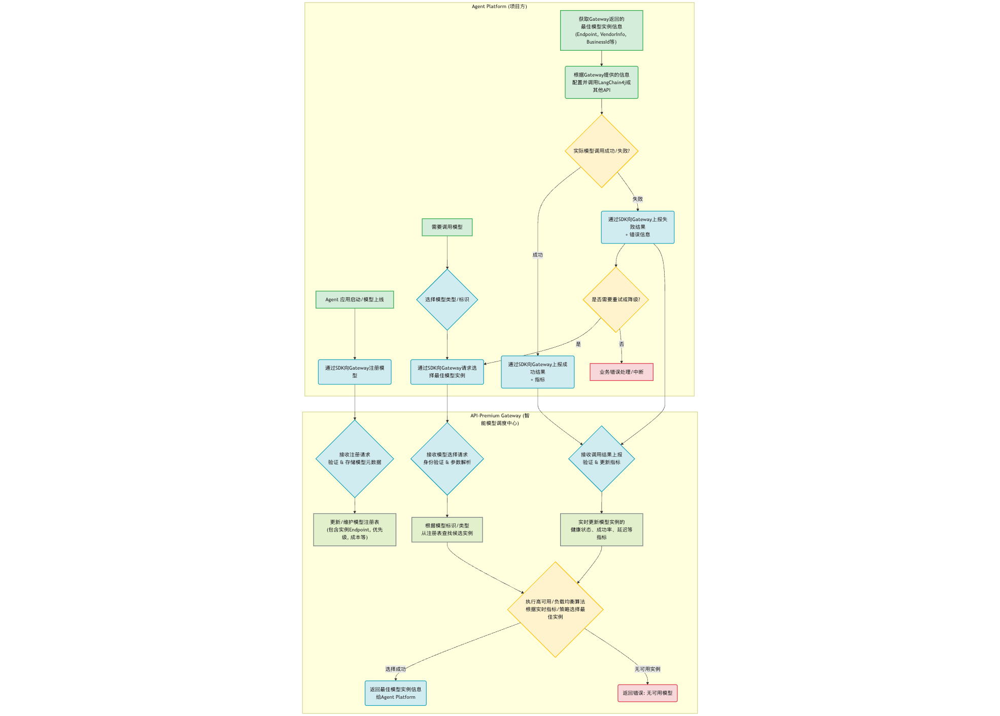

# API-Premium Gateway

-----

## 项目的由来

该项目由 AgentX 项目引入，因需要对模型的选择高可用。

## 🚀 项目概览

**API-Premium Gateway** 是一个轻量级、自研的 Java 服务，旨在为您的分布式系统和应用提供**强大的 API 高可用与智能调度能力**。它作为您服务调用各类后端 API（包括第三方服务、自建微服务、AI 模型等）的**智能中间层**，确保您的业务在面对外部API波动时依然稳定可靠。

**核心解决问题：**

  * **API 不可用：** 某个第三方 API 或自建服务宕机了怎么办？
  * **性能瓶颈：** 某个 API 实例响应慢或负载高，如何自动切换？
  * **多租户管理：** 不同项目或用户如何隔离地使用和管理 API 资源？
  * **调用可观测性：** 如何实时了解后端 API 的健康状况和性能表现？

-----

## ✨ 核心特性

  * **⚡️ API 高可用：**
      * **平替（Fallback）：** 当首选 API 实例失效时，自动无缝切换到其他可用实例。
      * **降级（Degradation）：** 在高优先级API不可用时，可选择切换到功能受限但更稳定的备用API。
      * **熔断（Circuit Breaker）：** 自动隔离故障API，防止雪崩效应。
      * **限流（Rate Limiting）：** 保护后端API不被过量请求压垮。
  * **🧠 智能调度与负载均衡：**
      * 根据API实例的**实时性能指标**（成功率、延迟）、**成本**、**优先级**等，动态选择最佳的调用路径。
  * **🔐 安全与隔离：**
      * 支持**多项目、多用户**的API资源隔离管理。
      * 提供统一的**API Key/Token 鉴权**机制，确保接口安全。
  * **📊 调用可观测性：**
      * 实时**收集并分析**API调用结果（成功/失败、延迟、Token使用等），为决策和监控提供数据支撑。
  * **🛠️ 简洁高效：**
      * 基于 Spring Boot 自研，不依赖复杂网关框架，专注于核心功能，保持轻量级和高性能。
      * 通过**SDK**简化上游服务集成。

-----

## 🚀 工作原理

API-Premium Gateway 扮演着**智能决策者**与**状态收集者**的角色。它不直接代理实际的 API 请求，而是提供一套机制，让上游服务：

1.  **注册 API 实例：** 上游服务启动时，通过 Gateway SDK 上报自身可用的后端 API 实例（如 OpenAI 的 GPT-4o、自建的图片生成服务等），并附带其 `actualEndpoint`、`providerInfo`、`优先级`、`成本` 等元数据。
2.  **请求智能选择：** 当上游服务需要调用某个逻辑 API（如 `gpt4o`）时，它首先向 Gateway 发送请求，Gateway 会根据内部算法（高可用、负载均衡、熔断等）选择当前**最佳**或**可用**的后端 API 实例。
3.  **上游服务执行调用：** Gateway 返回选定的 API 实例的详细信息（如 `actualEndpoint`、`businessId`、`providerInfo`）。**上游服务拿到这些信息后，自行发起对后端 API 的实际调用。**
4.  **上报调用结果：** 无论调用成功或失败，上游服务都必须将结果（成功/失败、延迟、错误信息等）上报给 Gateway。Gateway 利用这些数据实时更新后端 API 实例的健康状况和性能指标，为下一次决策提供依据。

-----

## 📐 架构概览




-----

## 🛠️ 技术栈 (初步)

  * **后端框架：** Spring Boot 3.x
  * **数据存储：** MySQL / PostgreSQL
  * **缓存/分布式状态：** Redis (可选，用于集群部署时共享 API 实例状态)
  * **HTTP 客户端：** Spring WebClient (非阻塞、高性能)
  * **鉴权：** JWT / API Key 认证
  * **SDK：** Java (基于 Spring `WebClient` 封装)

-----

## 📦 如何开始 (开发/集成)

### 1\. 克隆项目

```bash
git clone https://github.com/your-org/api-premium-gateway.git
cd api-premium-gateway
```

### 2\. 配置数据库

创建您的 MySQL/PostgreSQL 数据库，并更新 `application.yml` 或 `application.properties` 中的数据库连接信息。

### 3\. 构建与运行 Gateway

```bash
# 构建项目
./mvnw clean package

# 运行项目
java -jar target/api-premium-gateway.jar
```

（具体命令可能需要根据您的实际项目结构调整）

### 4\. 上游服务集成 (Java SDK)

1.  **添加 SDK 依赖：**
    （一旦 SDK 发布到 Maven 中央仓库或您的私有仓库，您可以在 `pom.xml` 中添加依赖。）
    ```xml
    <dependency>
        <groupId>com.your-org</groupId>
        <artifactId>api-premium-gateway-sdk</artifactId>
        <version>1.0.0-SNAPSHOT</version>
    </dependency>
    ```
2.  **配置 SDK：**
    在您的 Spring Boot 应用中配置 Gateway 的基础 URL 和 API Key。
3.  **注册 API 实例：**
    在应用启动时（例如，使用 `ApplicationRunner` 或 `@PostConstruct`），通过 SDK 调用 Gateway 的注册接口。
    ```java
    // 示例：注册一个模型API实例
    gatewaySdkClient.registerApi(
        "my-project-id",
        "user-id-optional",
        "gpt4o-model",
        "model",
        "my-gpt4o-business-id-001",
        "https://api.openai.com/v1/chat/completions",
        Map.of("provider", "OpenAI", "version", "gpt-4o"),
        Map.of("priority", 100, "costPerToken", 0.000015)
    );
    ```
4.  **选择并调用 API：**
    在业务逻辑中，通过 SDK 请求 Gateway 选择最佳 API 实例，然后自行调用。
    ```java
    // 1. 请求 Gateway 选择最佳 API
    SelectedApiInstance selectedApi = gatewaySdkClient.selectApi(
        "my-project-id",
        "user-id-optional",
        "gpt4o-model",
        "model"
    );

    // 2. 根据 Gateway 返回信息，执行实际调用
    // ... 使用 selectedApi.getActualEndpoint() 和 selectedApi.getProviderInfo()
    // ... 调用 LangChain4j 或其他 HTTP 客户端库

    // 3. 上报调用结果
    gatewaySdkClient.reportApiResult(
        "my-project-id",
        "user-id-optional",
        "gpt4o-model",
        selectedApi.getBusinessId(),
        true, // success
        150L, // latencyMs
        null, // errorMessage
        null, // errorType
        Map.of("promptTokens", 100, "completionTokens", 200) // optional metrics
    );
    ```

-----

## 🤝 贡献

我们欢迎所有形式的贡献！如果您有任何问题、建议或发现了 Bug，请随时提交 Issue 或 Pull Request。

-----

## 📄 许可证

本项目采用 [MIT 许可证](https://www.google.com/search?q=LICENSE) 发布。

-----
